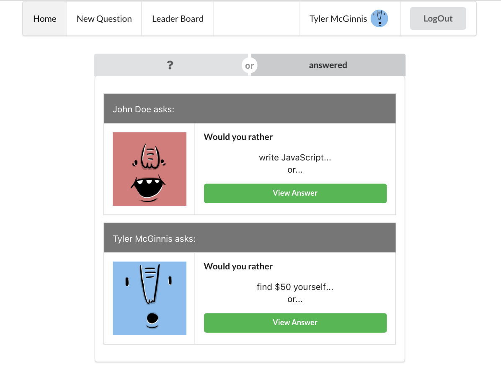

# Would You Rather ?

#### Project Overview
In the "Would You Rather?" Project, you'll build a web app that lets a user play the “Would You Rather?” game. The game goes like this: A user is asked a question in the form: “Would you rather [option A] or [option B] ?”. Answering "neither" or "both" is against the rules.

In your app, users will be able to answer questions, see which questions they haven’t answered, see how other people have voted, post questions, and see the ranking of users on the leaderboard.

* * *




                   **This is the main page after the completion**


* * *

####  Installation

```
1. git clone xxx
2. open a file
3. yarn install
4. yarn start 
```

* * *


**The project can be viewed in the browser at**

- [http://localhost:3000](http://localhost:3000)